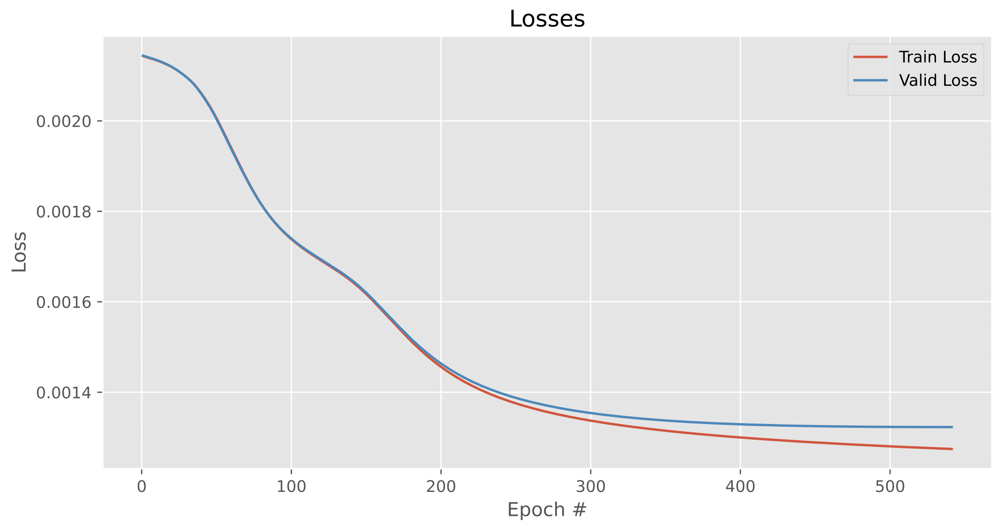

# Problem understanding: Text Classification using Full Convolutional NN #
In this toy project, we aim to build a deep learning clssifier that predicts whether a text is a positive or negetive review.
In this project you will try to use NN, namely FC NNs, for the task of
text classification. Here is what we did:

• We converted the text into vectors of numbers, using different ways for word repre-
sentation that can used with FC NNs.

• We explained the different ways for sentence representation 
• Explain different ways to deal with sentences of different length (padding, truncating, etc).
• Train a FC NN for text classification.  We used PyTorch for training the network.
• Analyze and describe the difficulties in training FC NNs on text data. </br>

Refer to this [link](https://www.kaggle.com/datasets/prakharrathi25/google-play-store-reviews) to get the data.

[](https://colab.research.google.com/drive/1375jOKvtvyeEcn71kRL5VlmgS36EY4Qi?usp=sharing)

# Run the project #
In this project, we have two steps: training and predicting. In the predict step, you can type a sentence as a review  and predict it. Let's show you how to run the project.

If you do not have venv package, please refer to this [link](https://linuxize.com/post/how-to-create-python-virtual-environments-on-ubuntu-18-04/)
</br>

## Create virtual environment ##

```
$ python3 -m venv ENV_NAME
```
## Activate your environment ##

```
$ source ENV_NAME/bin/activate
```

## Requirement installations ##
To run this, make sure to install all the requirements by:

```
$ pip install -r requirements.txt 
```
# Training the model #

```
$ python3 main.py 
```

# Results Presentation

```BoW train result```  </br>
 

``` TF-IDF train result```  </br>
 

```BoW predict result result```  </br>
 

``` TF-IDF predict result```  </br>
 

# Make prediction #

```
$python3 predict.py
```
___

---
___


<!-- # Contributors # -->
<!-- <div style="display:flex;align-items:center">

<div style="display:flex;align-items:center">
    <div>
        <h5> <a href='https://github.com/Toadoum'> Mr. Sakayo Toadoum Sari </a> </h5> 
<div>
    <h5> <a href='https://github.com/fad-ila'> Mss. Fadila Hamid Abdulai </a> </h5> 
    
<div>
    <h5> <a href='https://github.com/fatimahaidara'> Mss. Fatoumata Haidara </a> </h5> 
<div>
    <h5> <a href='https://github.com/BFonteh'> Bonaventure Fonteh </a> </h5> 
    
</div>  -->